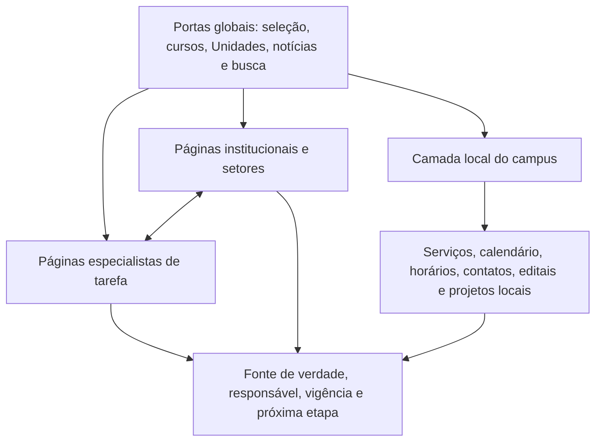
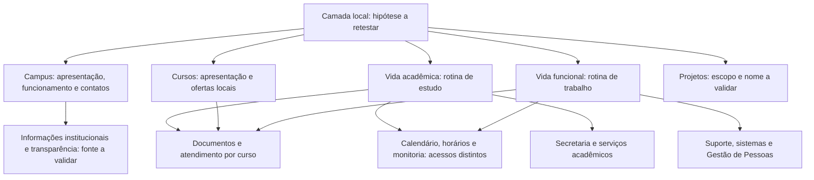

# Relatório estratégico de arquitetura da informação do portal do IFMG

**Período quantitativo principal:** 13 de abril de 2025 a 14 de abril de 2026

**Situação:** versão de handoff em 08/09/2026; implementação e aceite final pendentes

**Finalidade:** subsidiar a definição, a prototipação e a validação da arquitetura de informação do portal do IFMG.

## Resumo executivo

O portal concentra grande alcance em notícias, processos seletivos, cursos e busca. A análise anual auditada registra 8.516.005 visualizações; notícias respondem por 2.518.302 delas, processos seletivos por 1.603.573, cursos por 753.741 e as rotas de busca visível por 1.046.611. Esses dados indicam que a arquitetura deve dar visibilidade imediata às jornadas de ingresso, à descoberta de cursos, às notícias, às **Unidades** e à recuperação por busca, sem transformar volume de acesso em prova de perfil, intenção ou sucesso de tarefa.

O relatório recomenda uma arquitetura rasa e híbrida. A camada global reúne jornadas transversais; páginas especialistas apoiam tarefas recorrentes; páginas institucionais preservam a referência por setor; e a camada local das **Unidades** organiza serviços, prazos e informações próprias. A proposta é sustentada por dados de navegação, princípios de usabilidade, oito testes moderados com servidores da rodada de maio/junho, cinco entrevistas de manutenção editorial e uma rodada posterior em Ouro Branco com cinco estudantes e três servidores. As rodadas têm tarefas e condições distintas e permanecem separadas nas métricas.

Os testes com servidores já fundamentaram três ajustes prioritários: disponibilizar `Abrir chamado / Suporte de TI` em mais de uma rota; tornar `Remoção, redistribuição e carreira` visível na área de servidores; e manter páginas setoriais conectadas às tarefas. A escuta das **Unidades** acrescentou a necessidade de evitar notícias como contêiner genérico para comunicados e processos/editais. A rodada local de agosto/setembro já identificou fricções em calendário, monitoria, documentos de curso e suporte. A **próxima etapa** é corrigir e retestar esses caminhos, validar conteúdo com os setores e resolver as dependências técnicas e de governança descritas no plano de handoff (seções 17 a 19). O encerramento da coleta não comprova que o protótipo esteja pronto para publicação.

## Objetivo, escopo e método

O objetivo deste relatório é apresentar o diagnóstico que orienta o redesenho da arquitetura de informação, registrar as decisões de projeto derivadas das evidências disponíveis e indicar as validações necessárias antes de implantação.

Foram consideradas exportações auditadas do GA4, testes moderados com servidores e estudantes, entrevistas de manutenção editorial, reuniões de projeto e notas de encaminhamento até 08/09/2026. Reuniões documentam decisões e restrições operacionais; não substituem observação de uso. O complemento sobre bugs em outros sites foi fornecido pelo usuário em 08/09 e está identificado como relato. Os dados quantitativos descrevem superfícies e caminhos acessados. As evidências qualitativas descrevem dificuldades observadas no protótipo e requisitos de manutenção. Nenhuma das fontes identifica visitantes por perfil, mede conversão completa isoladamente ou substitui a validação com os públicos finais.

## 1. Diagnóstico quantitativo

O diagnóstico considera a exportação anual do GA4 com **8.516.005 visualizações** em 100.000 caminhos, além dos recortes auditados de referenciadores e dispositivos. Os achados abaixo descrevem tráfego de conteúdo e superfícies acessadas; não identificam o público visitante nem comprovam a conclusão de tarefas.

### 1. Notícias constituem uma das maiores superfícies do portal

Caminhos contendo `/noticias` somam **2.518.302 visualizações anuais**, correspondentes a **29,57%** do total analisado. No **Portal da Reitoria**, `/portal/noticias` soma **1.325.442 visualizações**; as Unidades e outros ambientes somam **1.192.860**. A superfície de notícias, portanto, não é marginal: tem alcance distribuído entre publicação da Reitoria e das Unidades.

A análise temática mostra que parte importante desse volume se relaciona a necessidades acionáveis: oferta de cursos e formação soma **1.167.234 visualizações**, ingresso e seleção soma **1.027.400**, e matrícula, chamada e convocação soma **321.738**. Como as categorias se sobrepõem, esses valores não formam uma divisão exclusiva; eles demonstram que notícias participam de jornadas de serviço.

Essa concentração também indica que, em parte dessas jornadas, a notícia vem ocupando o lugar de uma estrutura estável de serviço: uma pessoa precisa percorrer publicações para encontrar etapas, prazos, resultados, matrícula ou orientações que deveriam estar disponíveis em páginas permanentes e organizadas por tarefa. **A notícia deve informar e encaminhar para a próxima ação; não deve ser o único contêiner de uma tarefa recorrente.** A arquitetura proposta preserva a visibilidade editorial das notícias, mas cria ou utiliza superfícies próprias — como cursos, processos seletivos, matrícula, serviços acadêmicos e o menu de Editais do Wagtail — para que a jornada não dependa da cronologia de publicação.

### 2. Ingresso, cursos e matrícula formam um eixo de alta demanda observável

No ecossistema completo, caminhos contendo `processo-seletivo` somam **1.603.573 visualizações**, caminhos com segmento `/cursos` somam **753.741**, e caminhos contendo `matricula` somam **276.739**. No **Portal da Reitoria**, o prefixo `/portal/processo-seletivo` registra **790.051 visualizações**, enquanto `/portal/cursos` registra **219.857**.

Esses volumes sustentam a priorização de uma continuidade visível entre conhecer a oferta, localizar seleção e chegar às etapas posteriores de ingresso. Eles não demonstram, isoladamente, que uma pessoa completou esse fluxo.

### 3. Busca é uma superfície extensa com sinais de necessidade de investigação

As variantes visíveis de busca (`@@search`, `@@busca` ou `/search`) somam **1.046.611 visualizações anuais**. No **Portal da Reitoria**, o conjunto dessas rotas soma **486.952 visualizações**, com **71,14%** de rejeição ponderada e **7,72s** de engajamento ponderado. Esse valor agregado não substitui a leitura das rotas individuais: `/portal/search` registra **95,03% de rejeição** e **0,20s** de engajamento em 36.779 visualizações, enquanto `/portal/@@busca` apresenta comportamento distinto. A diferença reforça a necessidade de investigar e unificar a experiência de busca, em vez de tratar as rotas como uma única superfície homogênea.

O volume e as métricas agregadas justificam tratar busca como componente relevante do redesenho e instrumentá-la com termo, clique, zero resultado, refinamento e próxima etapa. Os dados atuais não permitem afirmar por que a busca foi usada nem se ela resolveu ou frustrou a necessidade.

### 4. Há demanda observável por serviços acadêmicos, funcionais e de controle

Além das superfícies de maior alcance, existem acessos relacionados a outras necessidades do portal: assistência, auxílio ou bolsa somam **134.489 visualizações** no ecossistema; calendário acadêmico, **138.685**; horários, **111.592**; e caminhos contendo `suap`, **21.792**.

Para serviços funcionais, o cluster `/portal/progep` soma **273.792 visualizações** anuais. No mapeamento ampliado, caminhos associados ao JTBD de servidores somam **386.995 visualizações (4,54% da base anual)**. Esse valor descreve um conjunto de caminhos relacionados a trabalho, carreira, sistemas, normativas e comunicados; **não identifica quem acessou como servidor**. Para informação pública e controle, caminhos de transparência/acesso à informação somam **43.395**, Ouvidoria soma **11.174**, e licitação ou contrato soma **9.182**.
Os dados indicam que o portal atende necessidades distintas além do ingresso, embora não permitam rotular as pessoas que acessaram essas páginas como estudantes, servidores ou órgãos de controle.

### 5. O contexto de uso reforça requisitos para notícias, seleção e serviços

No recorte exportado de dispositivos, notícias têm **65,39%** das visualizações em mobile e processo seletivo do **Portal da Reitoria**, **60,52%**. PROGEP no Portal da Reitoria apresenta maior participação em desktop, com **58,20%**. No recorte de referenciadores de 30 dias, páginas cuja referência imediata continha `/noticias` registraram **43.595 visualizações** em destinos como editais de extensão, matrícula, cursos, processo seletivo, calendário e horários.

Esses recortes sustentam priorizar experiência mobile para notícias e seleção, manter eficiência documental para PROGEP e testar conexões entre publicação e serviço. Como são recortes parciais, não devem ser anualizados nem tratados como identificação de perfis.

### Síntese do diagnóstico

O portal apresenta simultaneamente: alto alcance em notícias e jornadas de ingresso; uso relevante de busca; necessidade observável de acesso a serviços acadêmicos, funcionais e de controle; e diferenças de contexto de dispositivo entre superfícies. O desafio de design é dar caminhos curtos e compreensíveis às tarefas de maior alcance sem ocultar necessidades essenciais de públicos que o IFMG deve atender, preservando notícias como superfície funcional e de comunicação institucional.

Esse diagnóstico fundamenta a proposta de arquitetura, mas não comprova preferência por segmentação, sucesso de tarefa ou causalidade de abandono. Esses aspectos dependem de validação com usuários e instrumentação futura.

## 2. Evidências que orientam a arquitetura

### Superfícies de alcance e recuperação

| Superfície observada | Regra declarada | Visualizações anuais | Leitura para design |
| :--- | :--- | ---: | :--- |
| Notícias, todo o ecossistema | caminho contém `/noticias` | 2.518.302 | Publicações são uma porta relevante para tarefas e comunicação pública |
| Processo seletivo, ecossistema | caminho contém `processo-seletivo` | 1.603.573 | A jornada de ingresso exige destaque e continuidade |
| Busca visível ampliada | contém `@@search`, `@@busca` ou `/search` | 1.046.611 | Busca precisa ser unificada, compreensível e instrumentada |
| Cursos, ecossistema | contém segmento `/cursos` | 753.741 | A oferta formativa precisa de acesso direto e conexão com seleção |
| Página inicial do Portal da Reitoria | exatamente `/portal` ou `/portal/` | 566.781 | A página inicial deve expor portas prioritárias sem menus profundos |

A tabela evidencia que notícias, seleção, busca e cursos não são conteúdos periféricos: são superfícies de grande volume no conjunto analisado. Para o projeto, isso sustenta mantê-las visíveis na arquitetura global. Os agrupamentos podem se sobrepor, portanto a tabela não deve ser somada para estimar uma distribuição de jornadas.

### Superfícies funcionais do Portal da Reitoria

| Superfície do Portal da Reitoria | Visualizações anuais | Rejeição ponderada | Engajamento ponderado | Uso na decisão |
| :--- | ---: | ---: | ---: | :--- |
| Notícias | 1.325.442 | 41,16% | 17,19s | Manter publicação da Reitoria conectada a ações e temas públicos |
| Processos seletivos | 790.051 | 16,62% | 23,09s | Priorizar entrada global e hub de jornadas seletivas |
| Página inicial | 566.781 | 20,73% | 23,21s | Expor acessos prioritários e orientações iniciais |
| Busca ampliada | 486.952 | 71,14% | 7,72s | Tratar busca como componente crítico a melhorar e medir |
| PROGEP | 273.792 | 22,87% | 15,86s | Criar entrada clara para rotinas funcionais e carreira |
| Cursos | 219.857 | 11,60% | 27,62s | Integrar catálogo à decisão de ingresso |
| Assistência estudantil | 26.766 | 33,74% | 19,01s | Garantir caminho de permanência acadêmica |
| SUAP | 7.181 | 46,97% | 9,71s | Expor o sistema correto, sem usar volume como único critério |

No recorte do **Portal da Reitoria**, notícias e processos seletivos são os maiores conjuntos listados, enquanto PROGEP aparece como superfície funcional expressiva. A busca combina volume relevante com rejeição elevada e engajamento baixo, o que justifica tratá-la como ponto prioritário de investigação e instrumentação, sem concluir que toda rejeição representa falha.

### Jornadas operacionais além do maior volume

| Necessidade observada no ecossistema | Visualizações anuais | Por que precisa de cobertura |
| :--- | ---: | :--- |
| Matrícula | 276.739 | É continuidade crítica da jornada de ingresso |
| Calendário acadêmico | 138.685 | Resolve rotina acadêmica recorrente |
| Assistência, auxílio ou bolsa | 134.489 | Sustenta permanência e atendimento estudantil |
| Horários | 111.592 | Precisa ser recuperável nas Unidades, inclusive em mobile |
| Transparência/acesso à informação | 43.395 | É dever de informação pública, independentemente do ranking |
| SUAP | 21.792 | É o sistema acadêmico confirmado pela DTI |
| Ouvidoria | 11.174 | É canal público obrigatório de participação |
| Licitação ou contrato | 9.182 | Atende fiscalização, controle e transparência |

Esta tabela evidencia que o ranking de volume não pode ser o único critério da arquitetura. Matrícula, calendário, assistência e horários têm presença mensurável; transparência, Ouvidoria e contratações públicas precisam permanecer encontráveis também por obrigação institucional, mesmo com menor quantidade de visualizações.

## 3. Interpretação das evidências

### O que os dados sustentam

- Conteúdos de ingresso, formação e notícias concentram grande alcance e devem ter acesso imediatamente visível.
- O Portal da Reitoria também possui tráfego funcional relevante em PROGEP, justificando uma porta de entrada clara para serviços de servidores.
- Conteúdos acadêmicos e de controle têm volumes menores no Portal da Reitoria, mas são observáveis e precisam de rotas persistentes.
- A busca possui volume alto e baixo engajamento agregado; portanto, deve ser redesenhada e instrumentada para medir termo, clique, ausência de resultados e sucesso posterior.
- Notícias funcionam como superfícies de comunicação e potencial encaminhamento para serviços.

### O que os dados não sustentam

- Que determinada pessoa é estudante, ingressante, servidor ou integrante de órgão de controle por ter visitado uma URL.
- Que o volume de uma rota representa sucesso ou conclusão da tarefa.
- Que a estrutura atual causa abandono por profundidade de menu.
- Que redes sociais ou Google respondem por uma proporção anual específica do tráfego.
- Que a organização por perfil já foi validada como modelo preferido de navegação.

## 4. Papel das notícias na arquitetura

Notícias representam **2.518.302 visualizações anuais**, ou **29,57%** da base analisada. Seus assuntos mais lidos são fortemente acionáveis:

| Assunto de notícia | Visualizações | Implicação para o portal |
| :--- | ---: | :--- |
| Oferta de cursos e formação | 1.167.234 | Conectar a curso, modalidade, campus e inscrição |
| Ingresso e seleção | 1.027.400 | Conectar a edital, resultado, chamada e cronograma |
| Matrícula, chamada e convocação | 321.738 | Destacar a próxima ação e o prazo |
| Trabalho e oportunidades funcionais | 166.512 | Relacionar a editais e páginas de oportunidade |
| Assistência e permanência | 57.905 | Relacionar a serviço permanente de apoio |

A tabela evidencia que o conteúdo noticioso de maior volume frequentemente está associado a uma ação posterior, como escolher uma formação, acompanhar uma seleção ou realizar matrícula. Assim, a arquitetura editorial deve permitir encaminhamentos claros para páginas de serviço sem reduzir a notícia a um mero link transacional.

Os assuntos se sobrepõem e não devem ser somados como distribuição exclusiva. Entre os temas de missão e vínculo público, `Pesquisa, inovação e extensão` é o soft theme de maior volume classificado, com **78.501 visualizações**.

No recorte de referenciadores de 30 dias, **43.595 visualizações** ocorreram em páginas cuja referência imediata era uma notícia. Foram observados destinos como editais de extensão, matrícula, cursos, processo seletivo, calendário e horários. Isso sustenta a decisão de testar links e CTAs contextuais; não comprova conversão.

As notícias também exercem uma função de **branding institucional**: tornam visíveis a atuação do IFMG, seus projetos, resultados, oportunidades, impacto social e presença nas Unidades. Hoje, porém, essa função divide espaço com informações operacionais de ingresso, matrícula, resultados e serviços. Quando essas jornadas passarem a ter superfícies permanentes e bem organizadas, a área editorial poderá exercer com mais consistência seu papel de construção de identidade pública, reconhecimento e vínculo com a comunidade.

Esse fortalecimento não significa transformar notícias em publicidade institucional. Significa dar mais espaço editorial a conteúdos que evidenciem a missão e o valor público do IFMG: resultados de ensino, pesquisa, extensão e inovação; impacto nos territórios; projetos e pessoas; produção científica, cultural e tecnológica; oportunidades relevantes; e a diversidade de atuação das Unidades.

A estratégia de transição é: **(1)** retirar das notícias a responsabilidade de ser o único caminho para tarefas recorrentes; **(2)** manter, nas notícias acionáveis, um resumo claro, prazo e CTA para a página de serviço ou processo correspondente; e **(3)** usar a visibilidade editorial liberada para conteúdos de missão, impacto e identidade institucional. Assim, `Notícias` continua em posição de destaque, mas deixa de competir com a arquitetura de serviços e passa a cumprir melhor sua função de marca pública do IFMG.

## 5. Proposta de arquitetura

### Decisão em síntese

O portal do IFMG será estruturado com uma arquitetura **rasa e híbrida**:

1. Uma camada global dará acesso visível às jornadas de maior alcance observável, especialmente `Processos seletivos`, `Cursos`, `Notícias`, busca e acesso às Unidades.
2. Portas de entrada orientadas a públicos/JTBD organizarão serviços acadêmicos, serviços de servidores, relação com a comunidade e transparência.
3. Notícias acionáveis serão conectadas a páginas permanentes e etapas seguintes, enquanto notícias institucionais e de impacto permanecerão visíveis como componente do branding do IFMG.

### Segmentação por público como decisão institucional

A segmentação de partes do site por públicos não é uma conclusão comprovada pelo tráfego. Os dados não demonstram que visitantes navegam preferencialmente por perfis nem permitem distribuir acessos entre ingressantes, estudantes, servidores, comunidade ou órgãos de controle.

Ainda assim, organizar caminhos para esses públicos é uma decisão adequada ao papel institucional do IFMG. Como instituição pública, o Instituto precisa oferecer atendimento reconhecível tanto às pessoas em jornadas de grande volume, como ingresso e formação, quanto a estudantes, servidores, comunidade e órgãos de fiscalização e controle, ainda que suas demandas não ocupem o topo do tráfego observado.

A associação entre rotas e públicos é feita por **Jobs to be Done (JTBD)** inferidos a partir do conteúdo e das responsabilidades institucionais. Na abordagem de Alan Klement, um *job* não é só uma atividade: é o **progresso que uma pessoa tenta fazer, saindo de uma situação atual para uma situação preferida, apesar das restrições que encontra**. No portal, esse progresso pode se traduzir em necessidades como “acompanhar um processo seletivo”, “acessar um sistema para trabalhar” ou “pedir um documento acadêmico”. O conceito ajuda a organizar a navegação pela necessidade da pessoa, e não pelo nome da área administrativa que produz a informação. Ele permite formular uma arquitetura orientada a necessidades concretas, sem afirmar que o GA4 identificou quem acessou cada rota. Essa organização deverá ser validada por testes de encontrabilidade e de realização de tarefas. Para aprofundamento, ver [*When Coffee and Kale Compete*, de Alan Klement](https://www.whencoffeeandkalecompete.com/).

### 1. Arquitetura rasa para tarefas prioritárias

As jornadas de maior alcance e maior criticidade terão acesso em até dois níveis de decisão a partir da home, como hipótese de projeto a validar. O objetivo é tornar visíveis as opções essenciais e reduzir dependência de busca, sem alegar previamente ganho de sucesso.

Portas globais prioritárias:

| Porta global | Conteúdo principal | Base da prioridade |
| :--- | :--- | :--- |
| `Processos seletivos` | Hub de todos os processos seletivos do IFMG: ingresso de estudantes, concursos públicos, seleções para servidores, monitorias, bolsas acadêmicas e demais seleções institucionais | Alto volume observado em ingresso e necessidade institucional de concentrar processos, etapas e resultados |
| `Cursos` | Catálogo, modalidade, campus e relação com seleção | Alto volume de oferta formativa |
| `Unidades` | Entrada para serviços e notícias locais | Ecossistema descentralizado e necessidades locais |
| `Notícias` | Publicações institucionais, acionáveis, de impacto e construção de marca | Alto alcance observado e função de branding institucional |
| `Busca` | Recuperação transversal | Alto volume e necessidade de instrumentação |

As portas globais traduzem o diagnóstico em exposição prioritária: seleção e cursos respondem ao eixo de ingresso; notícias preservam serviço e marca; **Unidades** atendem à estrutura descentralizada; e busca permanece disponível como recuperação transversal. Sua posição e nomenclatura precisam ser verificadas em testes, especialmente quando houver sobreposição entre `Processos seletivos` e `Cursos`.

### 2. Organização híbrida por JTBD e obrigação pública

A camada funcional não será apresentada como personalização comportamental. Ela oferecerá caminhos reconhecíveis para públicos que precisam ser atendidos:

| Porta funcional a validar | Público/JTBD atendido                              | Conteúdo ou serviços previstos                             | Evidência e natureza da decisão                          |
| :------------------------ | :------------------------------------------------- | :--------------------------------------------------------- | :------------------------------------------------------- |
| `Processos Seletivos`     | Pessoas em qualquer jornada seletiva do IFMG | Ingresso, concursos públicos, seleções para servidores, monitorias, bolsas acadêmicas, editais, resultados e matrícula quando aplicável | Alto volume de ingresso + necessidade de reunir processos institucionais sem fragmentar etapas |
| `Estudantes`              | Resolver vida acadêmica e acessar apoio            | SUAP/AVA, calendário, horários, assistência, documentos    | Evidência de rotas + obrigação de atendimento            |
| `Servidores`              | Executar trabalho e acompanhar carreira            | PROGEP, sistemas, normativas, capacitação, afastamentos e comunicados internos | PROGEP no Portal da Reitoria: 273.792 views + validação com servidores |
| `Comunidade`              | Encontrar oportunidades e relação social do IFMG   | Extensão, cursos abertos, eventos, notícias e contato      | Inferência por missão e temas publicados                 |
| `Acesso à Informação`     | Fiscalizar e acessar informação pública            | Acesso à Informação, Ouvidoria, licitações e contratos     | Dever público + rotas observadas                         |

A tabela não representa segmentos detectados em analytics. Ela transforma necessidades de atendimento em portas testáveis: algumas são apoiadas por grande volume de conteúdo relacionado, como ingresso e PROGEP; outras são necessárias pela função pública do IFMG, como permanência estudantil e transparência.

### 3. Institucional sem competir com tarefas urgentes

O conteúdo institucional continuará acessível para explicar identidade, estrutura, missão, ensino, pesquisa, extensão e governança do IFMG. A decisão é não utilizá-lo como caminho obrigatório para serviços de alta urgência, nem como repositório indistinto de links operacionais.

## 6. Estrutura proposta de navegação

A estrutura abaixo recupera a organização híbrida concebida para o **portal do IFMG**. Ela articula portas globais de alto alcance com áreas funcionais destinadas aos públicos/JTBD que o IFMG deve atender. Os nomes e agrupamentos são proposta de arquitetura e precisam ser validados em teste.

### Navegação global de alta visibilidade

Elementos que devem permanecer imediatamente acessíveis na navegação principal por concentrarem jornadas relevantes ou funcionarem como recuperação transversal:

| Item global | Função no portal | Fundamentação |
| :--- | :--- | :--- |
| `Processos seletivos` | Centralizar os processos seletivos do IFMG: ingresso, concursos, seleções para servidores, monitorias, bolsas acadêmicas e demais editais seletivos | Jornada de ingresso de alto volume e necessidade de evitar processos dispersos em áreas e notícias distintas |
| `Cursos` | Permitir descoberta da oferta acadêmica por modalidade e campus | Alta procura por cursos e relação direta com ingresso |
| `Unidades` | Conduzir às Unidades e aos serviços/notícias locais | Necessidade da estrutura multicampi e volume distribuído de notícias/serviços |
| `Notícias` | Dar acesso à comunicação institucional, oportunidades, publicações acionáveis e conteúdos de marca/impacto | Grande alcance, papel de encaminhamento e necessidade de visibilidade do branding do IFMG |
| `Busca` | Recuperar conteúdo transversalmente | Alto volume observado; requer instrumentação e melhoria |

Na estrutura de menu, essa camada reúne acessos que não devem depender de a pessoa reconhecer previamente um perfil. Ela funciona como navegação transversal e preserva a visibilidade das notícias, inclusive quando sua função principal é comunicar identidade e impacto institucional.

### Áreas funcionais e institucionais

#### 1. Institucional

Espaço para conteúdos estáveis sobre identidade, estrutura e atuação do IFMG. Não deve concentrar serviços que a pessoa procura para executar uma tarefa imediata.

- Quem somos
- Missão, visão e valores
- História e estrutura
- Ensino
- Pesquisa e inovação
- Extensão
- Educação a Distância
- Internacionalização
- Desenvolvimento institucional
- Governança

#### 2. Estudantes

Área de serviços acadêmicos e permanência, voltada a pessoas que precisam resolver demandas da vida estudantil.

- + informações para estudantes
- SUAP/AVA
- Assistência estudantil
- Matrícula
- Calendários acadêmicos
- Horários de aula
- Diplomas e documentos
- Bibliotecas
- Oportunidades acadêmicas e intercâmbio
- Egressos

#### 3. Servidores

Área funcional para trabalho, carreira, normativas e sistemas institucionais.

- + informacões para servidores
- PROGEP
- Capacitação e afastamentos
- Normativas e manuais
- Remoção e carreira
- PGD e gestão do trabalho
- Suporte de TI
- Oportunidades e editais funcionais
- Comunicados e notícias internas, em **espaço dedicado a servidores** enquanto não houver intranet institucional

Os comunicados e as notícias voltados a servidores não devem disputar o mesmo espaço editorial das notícias públicas na página inicial. **Na ausência de uma intranet**, a área `Servidores` funciona como superfície dedicada para essa comunicação interna: ela reúne acesso a sistemas, carreira, serviços e comunicados, preservando a encontrabilidade sem deslocar as notícias destinadas ao público externo.

#### 4. Comunidade

Área de relação pública para pessoas, grupos e parceiros que interagem com o IFMG para além do ingresso regular. **Após os testes de usabilidade**, decidiu-se substituir o rótulo `Serviços` por `Comunidade`, em resposta à ambiguidade identificada: rotinas internas e serviços de servidores pertencem à área `Servidores`; serviços acadêmicos, à área `Estudantes`.

- Cursos de extensão e cursos abertos
- Projetos de extensão
- Pesquisa, inovação e parcerias
- Eventos
- Bibliotecas
- Comunicação e imprensa
- Fale conosco
- Uso da marca

#### 5. Transparência e controle

Área explícita de acesso público a informação, participação, fiscalização e conformidade.

- Acesso à Informação
- Transparência
- Ouvidoria
- Dados abertos
- Licitações e contratos
- Conselhos, resoluções e documentos institucionais
- PDI e relatórios públicos

### Pontos de validação da estrutura

| Questão de menu | Por que deve ser testada |
| :--- | :--- |
| `Estude no IFMG` como porta funcional ou `Processos seletivos` + `Cursos` apenas no eixo global | Verificar qual formulação reduz duplicidade e orienta melhor pessoas interessadas em ingresso |
| `Comunidade` como rótulo | Verificar se extensão, eventos, parcerias e relação institucional são reconhecíveis nesse agrupamento |
| Separação entre `Institucional` e `Transparência e controle` | Garantir que informação pública seja encontrável sem conhecer a estrutura administrativa |
| `Comunicados/notícias internas` em `Servidores` | Confirmar o requisito editorial da DTI/DECOM e a compreensão por servidores |
| `SUAP/AVA` e `Suporte de TI` | Validar termos corretos e descoberta dos serviços funcionais identificados em reunião/testes |

Essas questões concentram decisões ainda abertas. A estrutura pode ser defendida por dados, obrigação institucional e princípios heurísticos, mas somente testes com os públicos indicarão se os rótulos e a distribuição de itens produzem encontrabilidade adequada.

## 7. Fundamentação em usabilidade

As evidências quantitativas indicam quais superfícies e jornadas precisam ser priorizadas ou testadas. A escolha de uma arquitetura rasa e híbrida também se apoia em princípios consolidados de usabilidade e arquitetura da informação. Esses princípios constituem **argumentação de design**: não são resultados do GA4, nem substituem a validação com os públicos.

**Referências de design:** [Flat vs. Deep Hierarchy in Information Architecture — Nielsen Norman Group](https://www.nngroup.com/articles/flat-vs-deep-hierarchy/) e [10 Usability Heuristics for User Interface Design — Nielsen Norman Group](https://www.nngroup.com/articles/ten-usability-heuristics/).

### Arquitetura rasa e encontrabilidade

Uma **arquitetura rasa** é uma organização em que a pessoa chega a uma opção útil com poucas decisões de navegação, em vez de atravessar muitos níveis de menus e submenus. Ela aumenta a visibilidade das opções e reduz a necessidade de decorar a estrutura interna da instituição. Para o IFMG, esse princípio é aplicado às tarefas com alta relevância observada ou institucional: processos seletivos, cursos, matrícula, SUAP/AVA, assistência, serviços de servidores e transparência. Para aprofundamento, ver [Flat vs. Deep Hierarchy in Information Architecture (Nielsen Norman Group)](https://www.nngroup.com/articles/flat-vs-deep-hierarchy/).

A proposta não pressupõe que qualquer limite rígido de cliques garanta sucesso. Como critério de prototipação, as tarefas prioritárias devem estar acessíveis a partir da home por caminhos curtos e legíveis, e sua eficácia deve ser aferida em tree tests e testes moderados.

### Heurísticas de Nielsen aplicadas à decisão

As [10 heurísticas de usabilidade de Nielsen](https://www.nngroup.com/articles/ten-usability-heuristics/) são princípios de referência para avaliar a interface e orientar as escolhas abaixo.

| Heurística | Aplicação na arquitetura proposta | O que precisa ser validado |
| :--- | :--- | :--- |
| Correspondência entre o sistema e o mundo real | Usar rótulos reconhecíveis por necessidade, como `Processo seletivo`, `Matrícula`, `SUAP/AVA`, `Assistência estudantil` e `Acesso à Informação`, em vez de exigir conhecimento da estrutura administrativa | Compreensão dos rótulos e localização das tarefas por cada público |
| Consistência e padrões | Manter portas globais estáveis para seleção, cursos, Unidades, notícias e busca; aplicar estrutura previsível às páginas de serviço e notícias acionáveis | Expectativa de localização e reaprendizado entre páginas/áreas |
| Reconhecimento em vez de memorização | Expor atalhos e páginas especialistas de tarefa, evitando que a pessoa memorize em qual pró-reitoria, diretoria ou submenu um serviço está armazenado | Primeiro clique, tempo e taxa de sucesso em tarefas |
| Estética e design minimalista | Separar a prioridade operacional de jornadas urgentes da apresentação institucional e de impacto, sem apagar conteúdos de missão pública | Clareza da home e percepção equilibrada entre serviço e identidade |
| Ajuda e documentação | Reunir instruções, prazos, documentos e próxima etapa em hubs e notícias acionáveis, especialmente quando a tarefa continua em sistema externo | Capacidade de concluir a etapa ou identificar corretamente o próximo passo |

A tabela conecta princípios de usabilidade às escolhas propostas sem transformá-los em resultados observados. As heurísticas justificam por que vale testar rótulos orientados à necessidade, caminhos curtos e páginas de tarefa; a confirmação de que funcionam depende da validação.

### Compatibilidade com a segmentação por públicos

A organização por públicos/JTBD também é coerente com a heurística de correspondência com o mundo real: para muitas pessoas, a pergunta inicial não é qual unidade administrativa produz uma informação, mas o que precisam realizar, como ingressar, estudar, trabalhar, acessar um serviço ou fiscalizar a instituição.

Essa coerência conceitual fortalece a proposta, mas não prova que os rótulos escolhidos, a divisão das portas ou a distribuição dos conteúdos sejam os melhores. Por isso, a segmentação permanece uma decisão institucional fundamentada e uma hipótese de arquitetura a testar com os públicos atendidos.

## 8. Diretrizes de conteúdo e interface

1. Criar páginas especialistas de tarefa para ingresso, matrícula, assistência, SUAP/AVA e serviços de servidores.
2. Expor CTAs mensuráveis em notícias acionáveis: `ver edital`, `inscrever-se`, `ver resultado`, `solicitar matrícula` e `acessar serviço`.
3. Categorizar notícias por tema e público atendido no CMS, como decisão editorial. A necessidade mínima de separar notícias internas e externas foi registrada na reunião com a DTI de **25/05/2026**.
4. Manter soft themes visíveis em espaços de impacto e missão institucional, sem fazê-los disputar a mesma chamada de ação de fluxos transacionais.
5. Usar o rótulo `SUAP/AVA`.
6. Projetar notícias e seleção com prioridade para mobile: no recorte de dispositivos, notícias tiveram **65,39%** de visualizações mobile e processos seletivos do Portal da Reitoria, **60,52%**.
7. Projetar listagens e documentos de PROGEP para uso eficiente também em desktop: no recorte disponível, PROGEP no Portal da Reitoria teve **58,20%** de visualizações desktop.

### Fundamentos do Guia do Portal incorporados à proposta

As decisões de arquitetura só produzem efeito se forem acompanhadas por regras de conteúdo, acessibilidade e manutenção. Os fundamentos abaixo, consolidados no **Guia do Portal** — manual interno de arquitetura, conteúdo, acessibilidade e governança —, integram a proposta de arquitetura.

| Fundamento | Aplicação no portal do IFMG |
| :--- | :--- |
| **Organização** | Agrupar conteúdos por tarefa, público e assunto compreensível, em vez de reproduzir apenas a divisão burocrática interna. |
| **Rotulagem** | Usar o termo que a pessoa reconhece para a tarefa e explicar siglas quando necessárias. Por exemplo, nomear `Abrir chamado / Suporte de TI` antes do sistema que executa a ação. |
| **Navegação** | Combinar navegação global, local, contextual e links relacionados. Uma porta global dá orientação; páginas de tarefa e links contextuais levam ao próximo passo sem criar becos sem saída. |
| **Busca** | Tratar busca como caminho de uso e como fonte de pesquisa contínua: medir termo, resultado sem clique, refinamento, abandono e sucesso posterior. Uma busca muito usada não comprova, por si só, sucesso ou falha. |

**Linguagem simples e acessibilidade são requisitos de arquitetura, não acabamento editorial.** Linguagem simples permite localizar, compreender e usar uma informação para realizar uma ação. Acessibilidade garante que conteúdo, interface e serviços possam ser percebidos, operados, compreendidos e utilizados por diferentes pessoas e tecnologias assistivas. Portanto, rótulos, menus, documentos, formulários, imagens, links e mensagens de erro devem ser avaliados desde a definição da estrutura.

Na prática, isso exige que cada página ou fluxo crítico tenha: **ação e público claros; título e links descritivos; informações de fonte, vigência e responsável; próximo passo identificável; operação por teclado e semântica adequada; e regra de revisão, expiração ou arquivamento**. Um PDF sem estrutura, uma imagem que contém texto essencial ou um formulário inacessível podem interromper a jornada mesmo quando a pessoa encontra a página correta.

O ciclo de vida do conteúdo também é parte da arquitetura. Notícia, comunicado, edital, serviço, curso, evento, documento e contato devem ter tipos e regras compatíveis com sua atualização. Para conteúdos recorrentes ou de alto risco, a governança precisa definir quem publica, quem valida, quem atualiza, quando a informação perde vigência e qual fonte oficial permanece como referência.

Para aprofundamento e aplicação operacional:
- [W3C — Web Content Accessibility Guidelines (WCAG)](https://www.w3.org/WAI/standards-guidelines/wcag/);
- [Governo Federal — eMAG, Modelo de Acessibilidade em Governo Eletrônico](https://emag.governoeletronico.gov.br/).

## 9. Plano de validação

| Hipótese de design | Como validar | Métrica ou evidência esperada |
| :--- | :--- | :--- |
| Portas por JTBD tornam serviços encontráveis | Tree test e teste moderado com cada público | Sucesso, primeiro clique, tempo e compreensão do rótulo |
| Fluxo `Curso > Seleção > Matrícula` é compreensível | Teste de jornada com pessoas interessadas em ingresso | Conclusão e pontos de dúvida |
| Notícias com CTA conduzem ao próximo passo | Instrumentação e teste A/B ou comparação controlada | Clique no serviço relacionado e progressão da jornada |
| `SUAP/AVA` é compreendido por estudantes | Teste de encontrabilidade e clique externo | Sucesso na localização e acesso |
| Entrada de servidores atende rotinas reais | Teste moderado concluído com docentes e TAEs | Localização de PROGEP, TI, SEI e normativas; achados incorporados às decisões de arquitetura |
| Transparência permanece recuperável | Testes com tarefas de informação pública | Localização de Ouvidoria, licitações e documentos |

A tabela converte os argumentos do relatório em critérios verificáveis. A arquitetura só deve ser consolidada após evidenciar que as pessoas localizam as tarefas prioritárias, entendem os rótulos e conseguem prosseguir nas jornadas relevantes.

## 10. Resultados da validação qualitativa

Esta seção registra evidências coletadas **depois da formulação inicial** da proposta. Ela altera algumas decisões de detalhamento, mas não transforma uma amostra qualitativa em estimativa de comportamento de toda a comunidade do IFMG.

### Protocolo de anonimização

Este relatório preserva a identidade dos participantes dos testes por códigos. A rodada inicial usa vínculo amplo (`Reitoria` ou `Unidade`); a rodada local mantém `E-01` a `E-05` e `S-OB-01` a `S-OB-03`, com o campus como contexto do piloto. As reuniões são referenciadas por data e área, sem atribuir funções identificáveis aos participantes dos testes. A chave que relaciona identificadores aos registros originais permanece restrita aos arquivos de campo; ela não deve acompanhar versões compartilháveis deste documento.

| Grupo de evidência                        | Identificação usada neste relatório                                                  | Cobertura                                                   |
| :---------------------------------------- | :----------------------------------------------------------------------------------- | :---------------------------------------------------------- |
| Teste moderado de usabilidade             | Servidor 01 (Reitoria), Servidores 02–04 e 08 (Reitoria), Servidores 05–07 (Unidade) | Oito sessões consolidadas entre maio e junho de 2026        |
| Testes do piloto local | `E-01` a `E-05`; `S-OB-01` a `S-OB-03` | Cinco estudantes e três servidores, de 20/08 a 08/09/2026; tentativa interrompida excluída |
| Entrevistas de manutenção editorial local | Comunicador 01 a Comunicador 05 (Unidade)                                            | Cinco entrevistas com conteúdo suficiente para consolidação |

Os identificadores acima são pseudônimos de pesquisa, e não cargos, nomes, setores ou unidades. Tarefas não aplicadas ou não mensuradas ficam fora das contagens. Relatos exploratórios sustentam hipóteses, com limites explícitos. Conclusão após ajuda não equivale a encontrabilidade espontânea.

### O que os testes de usabilidade validaram

O teste moderado com oito servidores avaliou remoção/carreira, benefício, página setorial e sistemas/suporte. Ele confirma que a proposta de navegação orientada a tarefas precisa de **redundância controlada**, não de uma única porta por assunto.

| Achado validado | Evidência observada | Decisão incorporada |
| :--- | :--- | :--- |
| Suporte de TI não foi encontrado de forma confiável | Tarefa de sistemas/suporte: 6,3% de sucesso consolidado e dificuldade média de 6,9/7 | Expor `Abrir chamado / Suporte de TI` em `Servidores`, `Serviços` e na página institucional de TI; o rótulo nomeia a tarefa, mesmo que o destino seja um sistema externo. |
| Carreira e movimentação têm caminho, porém exigem procura | Remoção: 87,5% de sucesso e dificuldade média de 3,6/7; houve varredura de menus e uso de busca | Manter `Remoção, redistribuição e carreira` visível no segundo nível de `Servidores`, além do catálogo funcional. |
| Catálogo do servidor funciona após ser compreendido | Benefício: 100% de sucesso e dificuldade média de 1,6/7 | Preservar o `Guia do Servidor` como página especialista, com categorias escaneáveis, índice/busca e atalhos para tarefas críticas. |
| Setores continuam sendo uma porta mental relevante | Página setorial: 78,6% de sucesso e dificuldade média de 3,4/7; participantes alternaram entre tarefa e estrutura institucional | Adotar acesso duplo: páginas institucionais estáveis para setores e links cruzados para tarefas/serviços relacionados. |
| `Serviços` é semanticamente ambíguo | O rótulo foi associado tanto a serviços ao público quanto a sistemas internos | Explicitar o escopo da área e evitar usá-la como única porta para rotinas de servidores. |

Esses resultados **validam problemas de encontrabilidade no protótipo testado** e fundamentam os ajustes incorporados para a área de servidores. Eles não devem ser interpretados como preferência universal por qualquer rótulo ou menu.

#### Leitura detalhada do teste com servidores

Foram realizadas oito sessões moderadas entre maio e junho de 2026, com técnica de *think aloud*, tarefas guiadas e pergunta de dificuldade. A taxa de conclusão foi registrada como 1,0 para sucesso, 0,5 para sucesso com ajuda ou caminho indireto e 0,0 para falha/abandono. As escalas de dificuldade registradas de formas diferentes no campo foram normalizadas para **1 = muito fácil** e **7 = muito difícil**. Os identificadores preservam apenas o vínculo amplo indicado no protocolo de anonimização.

| Tarefa | Resultado consolidado | Interpretação |
| :--- | :--- | :--- |
| Localizar remoção/carreira | **87,5%** de sucesso; dificuldade média **3,6/7** | A tarefa foi concluída na maior parte das sessões, mas com hesitação, varredura de menu e busca textual. O destino existe, porém a rota não é imediatamente reconhecível. |
| Localizar benefício | **100%** de sucesso; dificuldade média **1,6/7** | O catálogo funcional funciona depois que a pessoa compreende sua finalidade. Isso sustenta a manutenção do Guia do Servidor, mas não como único acesso a tarefas críticas. |
| Localizar página setorial | **78,6%** de sucesso; dificuldade média **3,4/7** | A procura alterna entre categorias por tarefa e estrutura institucional. O resultado sustenta páginas setoriais estáveis conectadas a serviços, e não a substituição integral do modelo institucional. |
| Abrir chamado/acessar suporte de TI | **6,3%** de sucesso; dificuldade média **6,9/7** | A falha foi sistemática. O modelo mental observado associa suporte à tarefa `Abrir chamado` ou a `Serviços`, e não a um caminho oculto dentro de sistema. |

Os relatos abaixo foram selecionados por expressarem padrões recorrentes; foram anonimizados e não devem ser interpretados como consenso estatístico.

> “Abrir chamado? Eu iria em Serviços [...] não sei onde procurar.” — **Servidor 02, Reitoria**

> “Teria que ter um processo seletivo dentro de servidores ou movimentação de pessoal... agora onde está aqui eu não tenho ideia.” — **Servidor 03, Reitoria**

> “Serviços acho que o link para o SEI, SUAP e algum outro mais específico.” — **Servidor 04, Reitoria**

> “O Guia do Servidor então é como se fosse os serviços que o servidor poderia requerer de alguma forma, que ele tem acesso.” — **Servidor 03, Reitoria**

Esses relatos explicam por que a proposta não deve depender de um único agrupamento. `Serviços` é um rótulo amplo: pode significar serviço ao público, sistema interno ou suporte. `Guia do Servidor` é compreendido como catálogo depois de descoberta inicial, mas não comunica sozinho uma tarefa urgente. Já a procura por setores revela que uma arquitetura exclusivamente organizada por público ou tarefa apagaria uma estratégia de localização que ainda é relevante para parte dos servidores.

Como consequência, o relatório adota três regras para a próxima iteração: **nomear a tarefa antes do sistema**, **oferecer caminhos redundantes para tarefas críticas** e **manter ligação bidirecional entre páginas setoriais e páginas de tarefa**. Essas regras devem ser retestadas antes da consolidação final.

### O que as entrevistas nas Unidades acrescentaram

Cinco entrevistas com pessoas responsáveis por publicar, revisar ou encaminhar conteúdo local trouxeram evidência operacional sobre manutenção. Elas não substituem testes com estudantes, candidatos ou comunidade; esclarecem quais informações precisam de estrutura, vigência e responsável definidos.

| Padrão recorrente | Implicação para arquitetura e conteúdo |
| :--- | :--- |
| Calendário, horários, secretaria/requerimentos, contatos, cursos e editais são demandas locais recorrentes | A camada de campus deve ter acessos estáveis para essas tarefas, com fonte, vigência, responsável e data de atualização. |
| Editais e processos têm etapas, retificações, resultados e arquivos sucessivos | Utilizar o menu específico de Editais já disponível no Wagtail como referência do processo, com status, cronograma, documentos, resultados e arquivo; não usar uma notícia nova para cada etapa. |
| Notícias são usadas como atalho para conteúdo operacional | Separar `notícia`, `comunicado`, `edital/processo`, `evento` e `página permanente`, cada qual com regra de destaque, expiração e arquivamento. |
| Cursos reúnem vitrine pública e documentação operacional | Separar a apresentação do curso de documentos/rotinas, ou aplicar blocos claramente distintos; definir campos que podem ter manutenção distribuída. |
| Laboratórios, espaços, projetos, reservas e protocolo são serviços locais reais | Prever modelos de página de serviço/espaço com público, regras, contato, localização, formulário ou agendamento, responsável e atualização. |
| Republicação de conteúdo da Reitoria gera retrabalho, mas automação total pode ocultar o local | Tema pendente de solução: documentar o requisito de reduzir retrabalho sem comprometer a curadoria e o destaque local. |
| Contatos e documentos perdem confiabilidade sem dono | Instituir diretório por serviço/setor e acervo documental com fonte oficial, revisão periódica e rastreabilidade. |

### Ajuste da estrutura híbrida: camada local e acesso duplo

A arquitetura híbrida passa a ter três mecanismos complementares:

1. **Portas globais e páginas especialistas**, para tarefas de maior alcance ou urgência;
2. **Páginas institucionais estáveis**, para quem procura pela estrutura organizacional e para a governança do conteúdo;
3. **Camada das Unidades**, para serviços, prazos, contatos e especificidades locais que não devem ser escondidos nem duplicados no Portal da Reitoria.

O diagrama de decisão abaixo explicita a coexistência dessas rotas. A mesma informação deve ter uma fonte de verdade definida, mesmo quando recebe mais de um ponto de entrada.

### Mudanças de decisão decorrentes da validação

| Decisão anterior                            | Atualização                                                                                                    | Motivo                                                                                                         |
| :------------------------------------------ | :------------------------------------------------------------------------------------------------------------- | :------------------------------------------------------------------------------------------------------------- |
| Priorizar navegação por públicos/JTBD       | Manter, com acesso redundante por tarefa e por estrutura institucional quando houver modelo mental setorial    | Testes mostraram que uma única taxonomia não cobre todas as estratégias de procura.                            |
| Usar páginas especialistas                  | Manter e especificar que não podem ser o único caminho para tarefas críticas                                   | O catálogo foi útil após aprendizado, mas suporte e carreira exigem acesso explícito.                          |
| Tratar `Serviços`como área ampla            | Renomear para `Comunidade`, delimitar seu escopo público e duplicar acessos internos críticos em `Servidores`  | Nos testes, a expressão foi interpretada de formas conflitantes e podia sugerir uma área de serviços internos. |
| Priorizar notícias com CTAs                 | Manter, utilizando o menu de Editais do Wagtail para processos e definindo regras específicas para comunicados | A rotina das Unidades mostra que notícia não deve absorver atualizações operacionais sucessivas.               |
| Separar conteúdo da Reitoria e das Unidades | Formalizar uma camada local com curadoria, fonte de verdade e regras de republicação                           | Entrevistas revelaram tanto retrabalho de cópia quanto risco de soterramento pela automação.                   |

### Rodada local concluída: Ouro Branco

Entre 20/08 e 08/09/2026, o piloto reuniu cinco estudantes e três servidores. Calendário teve três conclusões em cinco tentativas estudantis, monitoria duas em cinco e secretaria quatro em quatro tarefas aplicadas. As dificuldades médias registradas para calendário e monitoria foram 4,2/7. Esses números orientam a iteração local; não medem toda a comunidade.

Em suporte de TI, as fichas registram `S-OB-01` = 1, `S-OB-02` = 0 e `S-OB-03` = 0,5 (com dicas). A última sessão também registrou PPC não encontrado sem intervenção (7/7), calendário localizado com ajuda (5,5/7) e caminho de orientação de atestado encontrado sem dica. Não houve execução comprovada do serviço externo. Os cenários não são idênticos aos da rodada de maio/junho e não devem ser combinados numa taxa de sucesso.

A evidência altera o detalhamento da arquitetura: documentos precisam ser acessíveis a partir do curso, calendários e horários atendem também a servidores e a distinção global/local precisa ser testada. `S-OB-03` preferiu o site atual por familiaridade, apesar de valorizar conteúdo funcional e visual limpo. Portanto, a aceitação do novo não é unânime nem comprova melhoria quantitativa.

**Fonte:** [[02 - Pesquisa (UXR)/testes-de-usabilidade/relatorios/02 - relatório testes Ouro Branco|Relatório de testes de Ouro Branco, atualizado em 08/09/2026]]. O relatório local contém resultados por tarefa e a matriz OB-01 a OB-12, com marcações das transcrições. As reuniões locais são tratadas separadamente na seção 17.

## 11. Validação no ambiente de homologação

O novo portal está em **ambiente de homologação**. Portanto, esta etapa não será avaliada por dados de GA4 nem por eventos de produção. A validação continuará por meio de **testes de usabilidade**, que permitem observar se as pessoas compreendem os rótulos, localizam os caminhos e conseguem avançar nas tarefas propostas.

O próximo ciclo retestará calendário, horários, monitoria, PPC, suporte, secretaria e estágio após os ajustes. Editais, contatos, busca, acessibilidade e a jornada completa de curso/ingresso ainda requerem cenários próprios. Antes das sessões, registrar versão do protótipo e verificar menu lateral, âncoras e acesso ao ambiente. Não declarar correções validadas apenas porque foram implementadas.

Os dados de navegação e eventos — como termos de busca, resultados sem clique, cliques em serviços relacionados e progressão de jornada — poderão ser planejados **após a publicação do portal em produção**. Eles não substituem os testes de usabilidade desta fase.

## 12. Limites de interpretação das evidências

| Camada | Definição neste documento |
| :--- | :--- |
| Evidência direta | Métricas agregadas de caminhos, dispositivos e referenciadores, com regras declaradas nos relatórios auditados |
| Inferência de design | Rotas e notícias podem atender JTBD de públicos específicos |
| Decisão institucional | O portal deve oferecer cobertura adequada a todos os públicos do IFMG, mesmo sem alto volume |
| Hipótese a validar | Arquitetura rasa, rótulos, agrupamentos por público e CTAs melhoram encontrabilidade e progressão |
| Não afirmado | Identidade do visitante, share de tráfego por público, intenção individual, conversão ou causalidade de abandono |

Este estatuto evita que uma decisão justificável seja comunicada como fato comportamental já comprovado. O relatório sustenta prioridades e escolhas de projeto, documenta sua base institucional e indica as evidências futuras necessárias para confirmá-las.

# Parte II — Aplicação da arquitetura nas Unidades

## 13. Finalidade desta parte

Esta parte traduz o diagnóstico e as decisões de arquitetura em temas de trabalho para os sites das Unidades. Ela é destinada à leitura da rede de comunicação e **não descreve uma solução fechada nem determina uma mudança imediata na rotina de publicação**.

O objetivo é construir uma arquitetura que ajude as pessoas a encontrar o que precisam e que também seja **sustentável para quem publica, atualiza, destaca e arquiva conteúdo todos os dias**. As decisões a seguir permanecem condicionadas à validação com usuários e à viabilidade operacional de cada campus.

### O que fundamenta a discussão

| Base | O que acrescenta | Uso neste relatório |
| :--- | :--- | :--- |
| Síntese auditada de evidências do projeto (relatório interno) | Métricas de alcance, busca, dispositivos, notícias, seleção, cursos e serviços | Define as jornadas que precisam de visibilidade e os limites da interpretação quantitativa. |
| Teste de usabilidade com servidores (relatório interno) | Dificuldades observadas em suporte, carreira, sistemas e páginas setoriais | Justifica acesso duplo por tarefa e por setor, rótulos orientados à ação e redundância para tarefas críticas. |
| Matriz de consolidação das entrevistas com comunicadores (documento interno) | Rotina de publicação, manutenção, vigência, retrabalho e especificidades locais | Define requisitos de conteúdo, governança e autonomia local; não substitui testes com estudantes ou comunidade. |
| Manifestação Fala.BR 23546.098951/2026-96, encaminhada pela Ouvidoria | Solicitação de padronização e atualização de transparência ativa nos portais das Unidades, incluindo corpo docente, encargos, disciplinas, horários e atendimento ao estudante | Reforça a necessidade institucional de páginas acadêmicas permanentes, dados com fonte oficial e rotina explícita de manutenção. Não define, por si só, o formato de publicação nem substitui a pactuação de governança. |
| Notas conceituais internas sobre arquitetura rasa e heurísticas de Nielsen | Princípios de encontrabilidade e usabilidade | Sustenta a escolha por caminhos curtos, reconhecimento visual, consistência e linguagem orientada à tarefa. |

## 14. O que as evidências significam para as Unidades

As entrevistas de manutenção não identificam preferências de estudantes ou candidatos. Elas mostram, porém, o que precisa ser sustentável para que uma arquitetura permaneça correta depois da publicação inicial. A tabela a seguir preserva a justificativa de cada encaminhamento.

| Achado | Justificativa e fonte | Implicação de arquitetura ou governança |
| :--- | :--- | :--- |
| **Calendário, horários, atendimento, secretaria e requerimentos** são demandas recorrentes. | A matriz de entrevistas registra recorrência desses conteúdos e necessidade de atualização frequente; a análise quantitativa também observa volume em calendários e horários. | Manter acessos estáveis na camada da Unidade, com fonte, vigência, responsável e data de atualização visíveis. Não devem depender de notícia ou PDF isolado. |
| **Contatos de setores** são difíceis de localizar e manter. | Entrevistas relatam triagem manual e risco de dados desatualizados. | Criar diretório confiável por serviço/setor, com responsável pela validação e ciclo de revisão. O formato detalhado continua em aberto. |
| **Editais, retificações, resultados e chamadas** viram sequência de notícias. | As entrevistas apontam sucessivas atualizações do mesmo processo; notícias de ingresso e matrícula também têm alto alcance no diagnóstico. | Utilizar o **menu específico de Editais já disponível no Wagtail** como referência do processo, organizando status, cronograma, arquivos, resultados e histórico sem multiplicar notícias. |
| **Serviços, laboratórios, espaços, projetos e oportunidades locais** não têm lugar próprio. | A matriz identifica necessidades de reserva, atendimento, formulários, regras de uso e divulgação local. | Definir modelos de página com público, finalidade, regras, contato, localização, responsável, vigência e, quando aplicável, agendamento. |
| **Cursos** combinam apresentação pública e documentação operacional. | As entrevistas apontam manutenção de dados locais, documentos, coordenação e diferenciais; a análise de tráfego sustenta que cursos são jornada de alta relevância. | Separar a vitrine pública de documentos e rotinas operacionais, ou tornar essa distinção explícita na própria página. A distribuição de permissões exige definição posterior. |
| **Transparência ativa acadêmica** precisa ser padronizada e atualizada nas Unidades. | A manifestação Fala.BR 23546.098951/2026-96 encaminhada pela Ouvidoria menciona corpo docente, encargos, disciplinas, horários e atendimento ao estudante. | Incluir no núcleo comum páginas para cursos, equipe e contatos, agenda acadêmica, horários, secretaria e serviços acadêmicos. Para cada dado, definir fonte oficial, responsável, periodicidade de revisão, vigência, arquivamento e avaliação de proteção de dados pessoais antes da publicação. |
| A melhoria editorial não substitui a conformidade administrativa das áreas responsáveis. | Demandas por informação atualizada podem revelar problemas de encontrabilidade e manutenção, mas não transferem à Comunicação a fiscalização de agendas individuais, escalas ou obrigações específicas de outras áreas. | Tratar a governança do site como distribuição explícita de responsabilidades: a Comunicação define padrões e apoia a publicação; cada área proprietária confirma a fonte, o conteúdo, a base normativa e a atualização; a instância competente avalia conformidade quando necessário. |
| Há **retrabalho** ao copiar conteúdo da Reitoria e risco quando a automação é total. | As entrevistas registram ambos os problemas: cópia manual e perda de destaque local com publicação indiscriminada. | **Não há solução definida neste momento.** O requisito de reduzir retrabalho sem comprometer curadoria e destaque local deve orientar uma etapa posterior de integração editorial. |
| O **conteúdo vencido** confunde usuários e sobrecarrega a equipe. | A rotina relatada inclui atualização de prazos, retirada de destaque e reuso de notícia para recuperar visibilidade. | Incluir vigência, status, expiração e arquivamento no modelo editorial. |
| A **autonomia** funciona melhor com estrutura e rastreabilidade. | As entrevistas apontam a necessidade de padrão de layout, responsabilidade registrada e revisão periódica. | Definir papéis, permissões, responsáveis e critérios editoriais comuns antes de ampliar autonomia de edição. |

### Princípio editorial

**Nem tudo deve ser notícia.** Notícias são essenciais para informar, dar visibilidade e comunicar a atuação do IFMG. Mas calendário, serviço, edital, comunicado, evento, documento, contato e página de curso têm ciclos de vida e necessidades de manutenção distintos. A arquitetura deve oferecer uma superfície apropriada para cada tipo, evitando que todos concorram pelo mesmo destaque editorial.

## 15. Estrutura proposta para os sites das Unidades

A camada das Unidades combina um **núcleo comum**, necessário para consistência e encontrabilidade, e uma **camada local**, necessária para preservar o que cada Unidade efetivamente oferece, atende ou comunica.

| Núcleo comum candidato | Camada local que requer autonomia |
| :--- | :--- |
| Cursos; equipe e contatos; calendário e horários; secretaria e serviços acadêmicos; editais/processos; notícias e comunicados | Serviços e espaços; laboratórios; projetos; parcerias; agenda; especificidades de cursos; documentos e orientações locais; prioridades sazonais |

**Essa divisão é uma hipótese de trabalho.** O que será padronizado, referenciado a uma fonte única ou mantido localmente depende de testes, da operação das Unidades e da definição de responsabilidades.

### Estrutura inicial do menu — hipótese para validação

O diagrama apresenta uma hipótese de navegação para análise. Ele não é o menu definitivo e deve ser confrontado com tarefas reais, necessidades locais e limites de manutenção antes de qualquer ampliação.

Esta hipótese substitui o desenho inicial que colocava licitações em Vida Acadêmica e usava “Colegiados” como entrada geral. As reuniões de 12/08 e 03/09 e o teste `S-OB-03` sustentam revisar esses caminhos, mas não definem sozinhos a taxonomia final. Editais e demais jornadas globais permanecem acessíveis na navegação global, com ligações locais quando necessárias.

### Pontos de avaliação

- Quais tarefas reais de estudantes, comunidade e setores locais ainda não estão contempladas?
- Quais itens não deveriam estar no menu, mas em uma página, bloco de serviço ou busca?
- Quais conteúdos precisam existir em todas as Unidades e quais só fazem sentido localmente?
- Os rótulos são claros para quem não conhece a estrutura interna do IFMG?

## 16. Decisões pendentes e próxima etapa

As questões abaixo não têm solução fechada. Elas devem ser tratadas como agenda de cocriação e validação, não como exigências de implantação imediata.

- **Governança de páginas de curso:** quais campos podem ser atualizados por coordenações e quais exigem comunicação.
- **Transparência ativa acadêmica:** qual é a fonte oficial e o formato de publicação para corpo docente, encargos, disciplinas, horários e atendimento; quem valida cada dado e em qual periodicidade.
- **Diretório de contatos:** qual formato será mais confiável e quem revisará cada informação.
- **Documentos locais:** como organizar atas, colegiados, portarias e referências às fontes oficiais.
- **Regras editoriais:** quais critérios definirão destaque, prioridade, vencimento e arquivamento.
- **Integração editorial Reitoria–Unidades:** como reduzir retrabalho sem perder curadoria local.
- **Rótulos e caminhos:** o que as pessoas realmente compreendem e encontram nos testes.

O próximo ciclo deve transformar os achados em decisões verificáveis. **A contribuição dos comunicadores é central para isso.**

1. **Validar e complementar** o inventário de conteúdos e serviços de cada Unidade.
2. **Definir quais processos devem usar o menu específico de Editais do Wagtail**, reduzindo notícias usadas como solução de contorno.
3. **Definir hipóteses de governança:** quem publica, quem valida, quem atualiza e quando algo sai do ar.
4. **Retestar os ajustes em Ouro Branco** com estudantes e servidores e validar a operação editorial antes do segundo piloto.
5. **Consolidar** o calendário compartilhado de entregas, validações e decisões a partir das contribuições recebidas.

## Fontes internas consultadas e referências externas

As fontes internas abaixo compõem o acervo do projeto e foram usadas na elaboração deste relatório. Seus conteúdos relevantes estão sintetizados no texto para que este documento possa circular de modo independente.

- **Top tasks do ecossistema:** volumes de notícias, busca, cursos e processos seletivos.
- **Top tasks do Portal da Reitoria:** volumes, rejeição e engajamento por superfície.
- **Anatomia e panorama anual das notícias:** temas, alcance, distribuição e função das notícias nas jornadas.
- **Síntese auditada de evidências e auditoria de confiabilidade:** regras de leitura, agrupamentos e limitações metodológicas dos dados.
- **Comparativo de públicos/JTBD:** clusters de rotas; não identifica visitantes.
- **Registro de alinhamento com a DTI, de 25/05/2026:** SUAP como sistema acadêmico institucional.
- **Guia do Portal e Manual de Redação e Linguagem Simples:** regras internas de arquitetura, conteúdo, acessibilidade e governança.
- **Benchmarking de modelos de páginas segregadas em instituição federal:** referência interna para tipos de página e organização de conteúdo.

Referências externas:
- [Flat vs. Deep Hierarchy in Information Architecture (Nielsen Norman Group)](https://www.nngroup.com/articles/flat-vs-deep-hierarchy/)
- [10 Usability Heuristics for User Interface Design (Nielsen Norman Group)](https://www.nngroup.com/articles/ten-usability-heuristics/)

---
**Conclusão:** a arquitetura apresentada é uma proposta tecnicamente fundamentada para prototipação. Sua aprovação final requer a confirmação de encontrabilidade, compreensão dos rótulos e progressão nas jornadas prioritárias com os públicos atendidos.

## Jornada de cursos: hipótese incorporada ao handoff

A jornada de cursos permanece uma frente de desenho e validação. A reunião com a PROEN e a rodada local reforçam tanto a apresentação para candidatos quanto o acesso direto à documentação por quem já estuda ou trabalha.

### 1. Reestruturação da jornada de cursos

O benchmark interno [[06 - Dados & Artefatos/documentos-referencia/evidencias/2026-08-27 - subsites de cursos do IFMG|Subsites de cursos do IFMG]] reúne o **Nosso IFMG** (Campus Ouro Preto) e a página **Pós IA** (Campus Formiga). Os dois casos reforçam que a oferta acadêmica circula em múltiplos pontos de entrada e que uma página de curso pode concentrar apresentação, requisitos, vagas, calendário, documentos e próximo passo.

**Hipótese e pendência C-01:** avaliar um hub institucional de cursos conectado a páginas padronizadas por oferta e à jornada `curso → edital → inscrição → resultado → matrícula`, preservando campos e particularidades administráveis pelas Unidades. O benchmark não valida uma solução única; ele sustenta a necessidade de testar essa arquitetura contra a fragmentação atual.

# Parte III — Handoff, reuniões e plano de continuidade

## 17. Registro consolidado das reuniões

**Corte documental: 08/09/2026.** A tabela reúne decisões, propostas e pendências relevantes do acervo de reuniões. “Relatado como concluído” significa que a fonte registra um avanço naquela data; não representa inspeção técnica atual. Pautas e avaliações são identificadas como tais. Os registros integrais permanecem nas fontes, sem duplicar transcrições neste relatório de síntese.

| Fonte | Evidência, decisão ou proposta registrada | Estado e consequência para o handoff |
| --- | --- | --- |
| R-01 — DTI, 14/04; Comunicação, 14/04; nota estratégica sem data | Integração dos campi, menor profundidade, áreas proprietárias alimentando conteúdo, Comunicação com manuais/treinamento e DTI com migração. A nota estratégica formula questões de público, identidade e critério de sucesso. | Direção de trabalho; pautas não comprovam deliberação. Formalizar papéis e critérios antes de expandir. |
| R-02 — Benchmarking IFRN, 15/04; avaliação, 16/04 | Modelos de página, migração seletiva, moderação, responsáveis e apoio institucional. A pauta contém números e terminologia anteriores à auditoria. | Referência externa relatada, não validação do IFMG. Preservar somente as métricas auditadas deste relatório; não reaproveitar números da pauta como resultado. |
| R-03 — DTI, 11/05 e 25/05 | Atualização de versão e portaria em discussão; coleções e permissões por grupos; possibilidade de edição com moderação; trabalho em script de migração. O registro de 25/05 confirma SUAP como sistema acadêmico. | Organização de acervo e papéis é pré-requisito operacional. A intenção de reaproveitar o ambiente foi revista em junho para criação de produção com cópia de dados. |
| R-04 — DTI, 22/06 | Novo servidor de produção com preservação dos dados cadastrados; backup do ambiente relatado como ativo; amostra de migração de notícias demonstrada. Fotos, anexos, tags e autoria em avaliação; transição em duplicidade ou por campus sugerida. | Não há comprovação de virada final. Verificar backup/restauração, carga complementar e plano de transição. O prazo de 15 dias foi sugestão, não calendário aprovado. |
| R-05 — PROEN, 03/07; nota sobre Espaço Ciência/SUAP, 01/07 | Separar duração de carga horária, explicitar modalidade/EAD/presencialidade, aproveitar dados oficiais já coletados, levantar diferenciais locais e conectar projetos aos cursos. Há relato de candidatos que esperavam EAD. | Validar a ficha por oferta com Ensino/coordenações. O relato não quantifica desistência. Integração e reaproveitamento de dados de projetos são propostas dependentes de fonte/API. |
| R-06 — TI, 06/07 | Migração limitada a notícias; importação de tags, até três fotos e anexos relatada como implementada; publicador original não será importado. Manter legado temporariamente, áreas decidem o que recriar e corrigir links relevantes via monitoramento de 404. | Decisões de escopo registradas. Verificar em homologação a integridade de amostras e definir duração do legado, responsáveis e rotina de correção. Não remover links indiscriminadamente. |
| R-07 — Comunicadores, 23/07 | Sugestões devem indicar problema, público, evidência, escopo, manutenção e validação. Núcleo comum com variações locais, ligações sem duplicação e implantação por pilotos. | Método de priorização. A preferência por estrutura não equivale a sucesso em teste. Pilotos ainda em seleção naquela data; a ordem foi definida em 17/08. |
| R-08 — DTI, 27/07 | Nomes de ambientes e autenticação SUAP relatados como ajustados; migração Joomla depende de exportações/amostras; API isolada proposta para reduzir dependência da atualização completa. Central de Serviços exige catálogo, SLA, grupos e escalonamento. | Confirmar alcance dos avanços e pendências com DTI. Previsões de agosto/setembro/outubro eram planejamento, sem confirmação de cumprimento. |
| R-09 — revisão local, 12/08 | Vida Acadêmica para rotina, área de trabalho, portal orientando ao processo responsável, vitrine de cursos e documentação ligada por contexto. “Colegiado” inadequado como entrada pública. Secretaria precisa de mapeamento; licitações/contratos de validação com área responsável. | Alinhamentos de desenho. Validar processos locais e nomenclatura; não presumir obrigação, ausência de obrigação ou fluxo idêntico entre campi. |
| R-10 — DTI, 17/08 | Ouro Branco como primeiro piloto e São João Evangelista como segundo; coleções/permissões antes da migração, acervo histórico e carga recente em etapas. Comunicação modelará serviços SUAP com apoio técnico, guia por papéis e vídeo da home em preparação. | Sequência acordada; conclusão de implantação não documentada. Validar operação de pelo menos dois pilotos antes de ampliar. API dinâmica de pessoas/vínculos ainda dependente de atualização. |
| R-11 — DTI, 31/08 | Propor portaria para criação de endereços passar pela Comunicação; investigar falhas intermitentes de âncora; retomar Comitê de Ensino. Próxima reunião indicada para 14/09. | Portaria é proposta, não norma vigente comprovada. Cache/propagação é hipótese. Reunião de 14/09 é ponto de controle indicado, não prazo de entrega geral. |
| R-12 — nota de assessoria de normas, 01/09 | Solicitação de página de integridade com normas, visitas/calendários, capacitações e informes; a nota indica alimentação pela área solicitante e urgência. | Requisito relatado; confirmar escopo, fonte e responsável formal. A referência à CGU não identifica ato normativo, logo não permite afirmar obrigação específica já verificada. |
| R-13 — revisão local, 03/09 | Revisar assistência estudantil; monitoria/tutoria ligadas ao ensino, visitas técnicas demandadas por docentes e tratadas pela extensão, NAPNEE com caminho próprio. Cards de serviço parecem notícia por exibirem data. Discutidos nomes alternativos, Projetos, estágio, consulta aos mantenedores e apresentação do OuroHub. | Validar conteúdo com setores, oferecer monitoria direta, testar nomes e cards. A operação local relatada não deve ser generalizada para todos os campi. Há necessidade de validar tanto uso quanto manutenção. |
| R-14 — complemento do usuário em 08/09 sobre R-13 | Relato de bugs no menu lateral direito também em outros sites que usam a mesma estrutura. | Evidência relatada, sem reprodução anexada. Hipótese de problema compartilhado; coletar exemplos e comparar instalações. Não equiparar automaticamente a falha às âncoras de R-11. |

### Decisões históricas que precisam de leitura atualizada

- **Ambiente:** preservar o conteúdo cadastrado permanece o requisito; a forma de migração para produção mudou ao longo das reuniões. Confirmar desenho atual com DTI antes da virada.
- **Migração:** tags e anexos, pendentes em junho, foram relatados como importados em julho. A migração completa e sua qualidade continuam dependentes de verificação e das exportações dos campi.
- **Pilotos:** a seleção em julho evoluiu para Ouro Branco e São João Evangelista em agosto. O primeiro já tem rodada de pesquisa registrada, mas isso não comprova piloto publicado nem validação do segundo.
- **Cursos:** separar apresentação e documentação não implica esconder documentos de quem entra por Cursos. A evidência posterior de `S-OB-03` exige ligações visíveis e cobertura das necessidades de trabalho.
- **Menus e componentes:** a compreensão parcial dos rótulos convive com dúvidas global/local e relatos técnicos. Investigar comportamento técnico e encontrabilidade em trilhas distintas.

## 18. Pendências do site atual e do protótipo: evidência separada de hipótese

A matriz OB-01 a OB-12 no relatório de Ouro Branco detalha as marcações de fonte. Os itens abaixo a incorporam ao handoff principal. “Pendente” significa ausência de comprovação de fechamento nas fontes consultadas, não que a equipe necessariamente deixou de agir.

| Pendência / contexto | Evidência disponível | Hipótese a validar | Entrega seguinte |
| --- | --- | --- | --- |
| OB-01 — site atual, padronização entre campi | Relato de dificuldade de achar PPC em outra unidade e facilidade quando a organização é semelhante. | Modelo comum por oferta reduz reaprendizado. | Inventário de documentos/caminhos e teste da mesma tarefa entre campi. |
| OB-02 — site atual, atualização | Relato de horário de atendimento desatualizado apesar de pedido de alteração. | Permissão delimitada e revisão reduzem dependência de intermediação. | Confirmar dado vigente, corrigir na fonte e pactuar responsável, suplência e fluxo editorial. |
| OB-03 — site atual, contatos e rolagem | Relato de pedidos frequentes de e-mails docentes e informações importantes no fim da página. | Sumário e diretório completo melhoram descoberta. | Auditar contatos de quem leciona no curso, sua fonte e posição; testar localização. |
| OB-04 — protótipo, PPC e contexto | Falha sem intervenção, 7/7; expectativa de Cursos e confusão global/local. | Acesso por curso e contexto de campus explícito ajudam. | Link para fonte documental e reteste sem explicação prévia. |
| OB-05 — protótipo, calendário | Calendário com ajuda, 5,5/7, reforçando fricção estudantil. | Entradas distintas para calendário, horários e monitoria ajudam. | Conteúdo validado e links/âncoras funcionais, seguidos de teste separado das tarefas. |
| OB-06 — protótipo, suporte | Caminho com dicas; expectativa de TI no campus. | Acesso local à tarefa reduz dependência do nome SUAP. | Confirmar canal e disponibilizar entrada explícita em mais de uma rota. |
| OB-07 — papéis sobrepostos | Calendário, horários, documentos e secretaria também são demandas de trabalho. | Rotas acadêmicas em Vida Funcional atendem mais de um papel. | Mapa de tarefas e links cruzados com uma fonte mantida. |
| OB-08 — projetos e oportunidades | Relato de estudantes buscando projetos/vagas; filtros sugeridos. | Diretório com participação, prazos e ligação ao edital ajuda. | Inventário com pesquisa, ensino e extensão, seguido de teste; integração condicionada à API. |
| OB-09 — documentação dos cursos | Solicitação de PPC, planos, matriz, normas, extensão, atendimento e campos locais. | Modelo comum com campos específicos equilibra cobertura e autonomia. | Pactuar ficha por oferta e responsável por cada bloco. |
| OB-10 — rótulos e ordem | Visitas técnicas entendidas como histórico; preferência por sistemas/Gestão de Pessoas primeiro. | “Solicitar visita técnica” e ordem por recorrência facilitam. | Validar processo, rótulo e ordenação; preferência individual não é ranking de uso. |
| OB-11 — transição e home | Preferência pelo atual, familiaridade e percepção de protótipo estático. | Conteúdo representativo e orientação de transição ajudam. | Testar home e mudança de navegação; rolagem/carrossel é sugestão, não requisito validado. |
| OB-12 — sustentação | Avaliação favorável de texto direto, visual limpo e orientação de atestado; pedido de manutenção contínua. | Revisão regular preserva utilidade. | Conferir orientação com área proprietária, revisão e próximo passo externo. |
| T-01 — menu lateral direito | R-13 e complemento R-14 relatam bugs, inclusive em outros sites de mesma estrutura. | Falha compartilhada de componente, versão ou configuração é possível. | Obter URLs, passos e evidência visual; comparar desktop/celular, navegador, versão e comportamento em instalação citada; DTI diagnostica antes de atribuir causa. |
| T-02 — âncoras | R-11 relata falhas intermitentes. | Cache/propagação foi hipótese inicial. | Testar URL publicada, preview, recarga e janela anônima; registrar destino, resultado e regressão após correção. |
| C-02 — classificação dos serviços | R-13 questiona assistência estudantil, visitas técnicas, monitoria/tutoria e NAPNEE. | Organização pelo serviço com responsável correto reduz desencontro. | Validar conteúdo local com Ensino, Extensão, assistência e NAPNEE; distinguir fonte administrativa da porta de acesso do usuário. |
| C-04 — nomes e apresentação de projetos | R-13 discute alternativas a Vida Acadêmica/Vida Funcional, ambiguidade de Projetos e apresentação do OuroHub/negócios pré-incubados. | Novos nomes, filtros e galeria podem ajudar, mas não há solução validada. | Propor alternativas com a equipe local, definir escopo e testar descoberta; distinguir ajuste editorial de dependência do componente. |
| T-03 — cards de serviço | R-13 relata aparência de notícia e ambiguidade da data. | Atenuar data do card e usar ação explícita melhora reconhecimento. | Avaliar suporte do componente com DTI e testar variante. Preservar data de atualização onde informa vigência. |

## 19. Plano de continuidade e critérios de aceite

### Situação de entrega

O handoff entrega diagnóstico, resultados locais, decisões históricas, propostas e dependências. Não declara conclusão de correções no Wagtail, migração final, publicação de portaria ou implantação da Central de Serviços. Cada item deve receber responsável nominal e data pactuada na passagem; abaixo há áreas sugeridas ou responsáveis institucionais citados nas reuniões.

| Frente | Área responsável / articulação | Próxima entrega | Dependência e aceite proposto |
| --- | --- | --- | --- |
| P-01 — correções de encontrabilidade | Comunicação/UX e Comunicação local, com áreas de conteúdo | Calendário, horários, monitoria, documentos e suporte com caminhos explícitos | Fonte vigente; versão do protótipo; reteste das tarefas críticas |
| P-02 — componentes e acesso | DTI com apoio da equipe local | Diagnóstico de T-01/T-02/T-03 e verificação do acesso ao ambiente | Exemplos reproduzíveis, versão/navegador, correção ou descarte fundamentado e verificação em celular e desktop |
| P-03 — processos acadêmicos | Ensino, coordenações, secretaria, assistência, Extensão e NAPNEE com Comunicação | Catálogo de serviços e documentos, fluxo local e fonte de cada informação | Validação dos mantenedores; distinção entre portal, formulário e sistema responsável |
| C-01 — jornada de cursos | Comunicação, PROEN, coordenações e DTI quando necessário | Ficha por oferta com modalidade, presencialidade, duração, carga horária, documentos e diferenciais | Dados oficiais conferidos; reuso dos dados já coletados; teste da jornada de descoberta e acesso documental |
| G-01 — conteúdo e permissões | Comunicação e áreas proprietárias; DTI configura grupos | Matriz de edição/revisão/publicação, coleções, suplentes e guia por papéis | Testar conta de editor e moderador, reutilização de arquivos, revisão e publicação sem acesso indevido |
| G-02 — serviços de Comunicação | Comunicação com apoio técnico SUAP/DTI | Catálogo com descrição, SLA, grupo e escalonamento | Chamado de teste percorrendo atendimento e retorno; responsáveis e capacidade definidos antes de lançamento |
| G-03 — endereços e sites | Comunicação, DTI e instância competente | Proposta de portaria/fluxo para novos endereços e alternativa no portal | Aprovação formal ainda a obter; registrar escopo e responsável de cada site |
| G-04 — integridade | Área solicitante de integridade/normas com Comunicação | Página com escopo, fonte documental, responsável e revisão | Confirmar referência normativa citada na nota; conteúdo validado pela área, sem atribuir fiscalização à Comunicação |
| M-01 — migração e virada | DTI, infraestrutura e áreas proprietárias | Amostra validada, carga histórica/complementar, backup e plano de transição | Conferir imagens/anexos/tags e links; teste de restauração; definir janela, legado, correção de 404 e decisão de publicação |
| V-01 — reteste e segundo piloto | Pesquisa/UX, Comunicação local e DTI para prontidão técnica | Reteste de Ouro Branco e preparação do piloto de São João Evangelista | Encerrar problemas críticos, validar manutenção e registrar particularidades antes de ampliar |
| G-05 — suporte e comunicação de mudança | Comunicação, gestão e áreas proprietárias | Guia, capacitação e roteiro de orientação aos públicos e editores | Definir canal de suporte, responsáveis, material de transição e rotina de revisão |
| C-03 — integrações e mídia | DTI, Comunicação e áreas de dados | Avaliação da API SUAP, projetos/pessoas, republicação com curadoria e vídeo da home | Confirmar disponibilidade, custo, fonte e responsável; não condicionar correções editoriais simples a integrações futuras |

### Sequência para a passagem

1. **Pactuar escopo e responsáveis:** revisar matrizes OB, T, C, G, M e V; distinguir correção imediata, desenho pendente e dependência externa. Usar 14/09, reunião indicada em R-11, como oportunidade de alinhamento se o encontro for mantido.
2. **Preparar homologação:** identificar versão, obter acesso, verificar menu lateral/âncoras e priorizar correções que podem comprometer o teste.
3. **Validar conteúdo e manutenção:** conferir serviços, documentos, contatos e dados de oferta com as áreas e executar um ciclo de edição/revisão/publicação.
4. **Implementar e retestar:** registrar o que mudou e reaplicar cenários sem orientação prévia do caminho. Separar achado de uso, relato e falha técnica.
5. **Deliberar sobre expansão e virada:** confirmar capacidade de suporte, segundo piloto, migração, backup, legado e plano de comunicação. Registrar decisão e exceções, em vez de inferir aceite pela entrega deste documento.

### Critérios propostos para o reteste

- Cinco estudantes de cursos/modalidades distintos e três servidores com demandas diferentes; registrar a mesma versão, dispositivo, cenário, conclusão, ajuda, dificuldade e tempo por tarefa.
- Em cada tarefa crítica aplicada aos cinco estudantes, buscar ao menos quatro conclusões sem ajuda, com dificuldade individual até 3/7 nesses casos. Para tarefas comuns aos três servidores, buscar três conclusões sem ajuda e analisar qualquer falha antes de ampliar. São critérios de trabalho a pactuar, sem inferência estatística populacional.
- Não contar tarefa não aplicada como falha nem como sucesso. Não agregar tarefas distintas de Gestão de Pessoas como um teste único do procedimento externo.
- Testar separadamente calendário, horários, monitoria, PPC a partir de Cursos, suporte local/global e secretaria/estágio. Acrescentar busca, contatos, acessibilidade e processos seletivos com cenários próprios.
- Concluir teste técnico e de manutenção com evidência: links corretos, menu e âncoras operáveis nos dispositivos cobertos, dados vigentes e pessoa responsável pela revisão. Definir no handoff os casos e o registro de aceite.

### Fontes de reunião e rastreabilidade

- R-01: [[01 - Reuniões/2026-04-14 - reunião com a DTI|DTI — 14/04]], [[01 - Reuniões/2026-04-14 reunião dcom|Comunicação — 14/04]], [[01 - Reuniões/reunião estratégica 01|Nota estratégica sem data]].
- R-02: [[01 - Reuniões/2026-04-15 - pautas-benchmarking-ifrn|Benchmarking — 15/04]], [[01 - Reuniões/2026-04-16 - avaliacao-reuniao-ifrn|Avaliação — 16/04]].
- R-03: [[01 - Reuniões/2026-05-11  reunião com a DTI|DTI — 11/05]], [[01 - Reuniões/2026-05-25 • reunião com a DTI|DTI — 25/05]].
- R-04: [[01 - Reuniões/2026-06-22 - reunião com a DTI|DTI — 22/06]].
- R-05: [[01 - Reuniões/2026-07-03 - reunião com a PROEN|PROEN — 03/07]], [[00 - Inbox/2026-07-01 - conversa com Juliano sobre Espaço Ciência e SUAP|Nota Espaço Ciência/SUAP — 01/07]].
- R-06: [[01 - Reuniões/2026-07-06 - reunião com a TI|TI — 06/07]].
- R-07: [[01 - Reuniões/2026-07-23 - reunião com comunicadores|Comunicadores — 23/07]].
- R-08: [[01 - Reuniões/2026-07-27 - reunião com a dti|DTI — 27/07]].
- R-09: [[01 - Reuniões/2026-08-12 - reunião com a Lorena|Revisão local — 12/08]].
- R-10: [[01 - Reuniões/2026-08-17 - reunião com a DTI|DTI — 17/08]].
- R-11: [[01 - Reuniões/2026-08-31 - reunião com a DTI|DTI — 31/08]].
- R-12: [[00 - Inbox/2026-09-01 - reunião com renato - assessoria de normas...|Nota sobre integridade — 01/09]].
- R-13/R-14: [[00 - Inbox/2026-09-03 – reunião com a Lorena|Revisão local — 03/09 e complemento de 08/09]].
- Controle complementar: [[00 - Inbox/2026-07-02 - checklist promessas entrevistas portal|Checklist de promessas e sugestões]]. Itens marcados como concluídos no checklist não substituem validação atual; itens em aberto continuam sujeitos à triagem.

As transcrições automáticas e as notas breves podem conter ambiguidades. Onde a fonte não estabelece conclusão, prazo ou responsável formal, este relatório registra a pendência. A evidência nova deve atualizar o estado do item e preservar a referência histórica.
